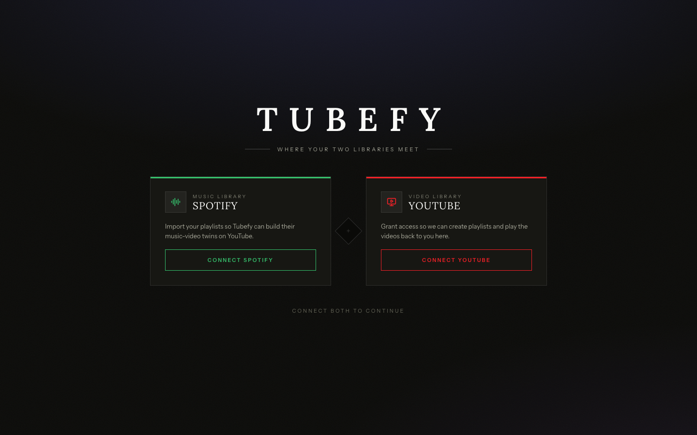
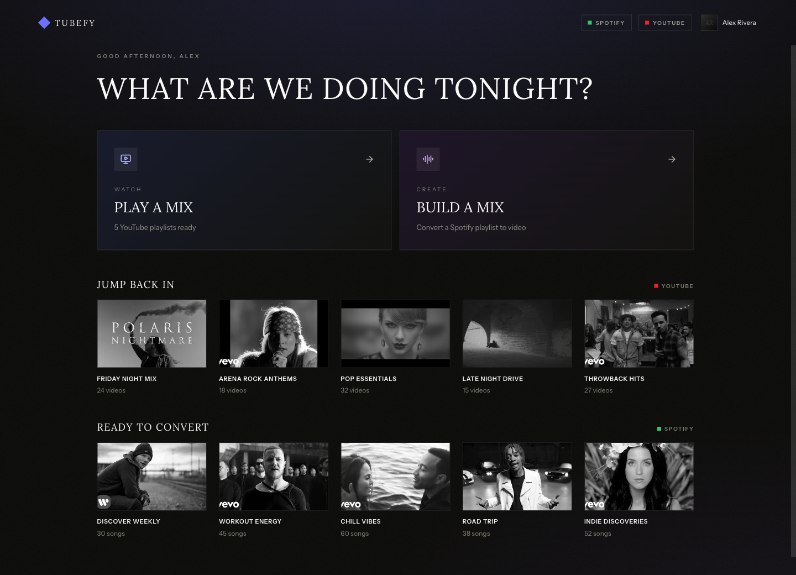
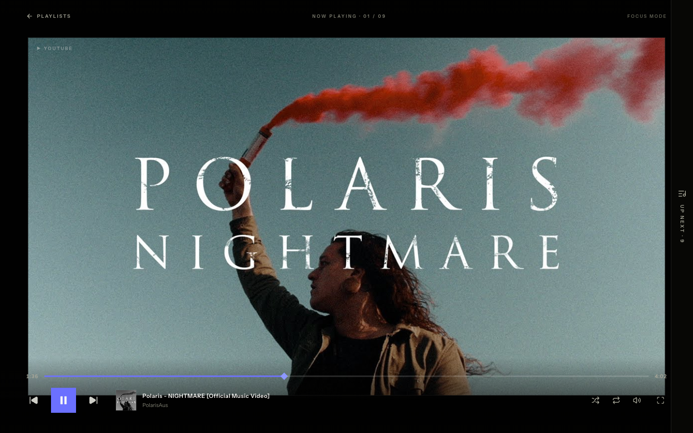

# Tubefy

A cinematic web app that turns your Spotify playlists into YouTube music-video
mixes, built with React 19, Vite, and Tailwind CSS, powered by the Spotify and
YouTube APIs.

This is a frontend portfolio piece. It exists to demonstrate a polished,
real-world product built on two live, OAuth-protected APIs: connect Spotify and
YouTube, match each Spotify track to its best music video, review and remap the
shaky matches, build the playlist on your YouTube, and play it back in a
cinematic focus-mode player. There is no backend and no client secrets, all of
the OAuth runs in the browser.



Once both platforms are linked, the home dashboard is the hub: jump back into a
YouTube playlist, or pick a Spotify one to convert.



## Features

- **Connect both platforms** with real OAuth, entirely client-side: Spotify
  Authorization Code + PKCE, and Google Identity Services for YouTube. No
  backend, no client secrets. The app unlocks only once both are linked.
- **Watch** any of your YouTube playlists in a cinematic focus-mode player built
  on the YouTube IFrame Player API: custom controls over the video, a
  hover-reveal up-next queue, auto-advance, working shuffle / repeat / volume /
  fullscreen, and chrome that auto-hides.
- **Create** a YouTube playlist from a Spotify one. Tubefy searches YouTube for
  each track and scores the candidates on duration proximity, channel type
  (Official Artist / VEVO / "- Topic" art tracks beat covers and fan uploads),
  and title similarity, labelling every match **strong** or **to check**.
- **Review and remap** each match before committing, with an inline panel of
  alternate videos. Tracks with no match are clearly flagged and skipped, and
  the flow never creates an empty playlist.
- **Build on your channel**: creates a private playlist and inserts each chosen
  video in order, and is resumable if a build fails partway through.
- **One cinematic design system** (shadcn's `base-sera`): sharp corners, a
  brightened indigo accent, grayscale artwork that reveals color on hover, and
  expressive motion with a reduced-motion fallback.



## Tech stack

- **React 19** with **TypeScript**
- **Vite** (a pure frontend SPA, no backend)
- **Tailwind CSS v4** + **shadcn/ui** (the `base-sera` style)
- **react-router** for the screen flow
- **Spotify Web API** (Authorization Code + PKCE)
- **YouTube Data API v3** and the **YouTube IFrame Player API**, authorized with
  **Google Identity Services**

## Getting started

Tubefy talks to the real Spotify and YouTube APIs, so it needs your own OAuth
**client ids** (there are no client secrets). See [SETUP.md](SETUP.md) for the
full walkthrough: creating the Spotify and Google Cloud apps, scopes, redirect
URIs, test users, and quota notes.

### Prerequisites

- **Node.js 20 or newer**
- **pnpm** (this repo uses a pnpm lockfile). If you do not have it, enable it
  with Corepack:
  ```bash
  corepack enable pnpm
  ```

### Install and run

```bash
# install dependencies
pnpm install

# add your OAuth client ids
cp .env.example .env.local

# start the dev server
pnpm dev
```

Then open [http://127.0.0.1:5173](http://127.0.0.1:5173). The dev server uses the
loopback IP on purpose: Spotify no longer allows `localhost` as an OAuth redirect
host.

### Other scripts

```bash
pnpm build      # typecheck + production build
pnpm typecheck  # type-check only
pnpm lint       # run ESLint
```

## Project structure

```
src/
  App.tsx           routes + auth guard
  pages/            one folder per screen (login, home, watch, player, create/*)
  components/       shared UI: design-system primitives, cards, player chrome
  context/          auth state + the create-flow state (matching -> review -> success)
  hooks/            useAsync, useYouTubePlayer
  lib/
    spotify/        auth (PKCE) + Web API client
    youtube/        auth (Google Identity Services) + Data API client + IFrame loader
    matching/       candidate scoring + the track-to-video matcher
    config.ts       env-driven configuration
  index.css         cinematic design tokens + motion
```

## APIs and attribution

Data and playback come from the [Spotify Web API](https://developer.spotify.com)
and the
[YouTube Data API v3 / IFrame Player API](https://developers.google.com/youtube).
Spotify and YouTube are trademarks of their respective owners. This is a
non-commercial portfolio project made for learning, and is not affiliated with or
endorsed by Spotify or YouTube / Google.

## License

Licensed under the Apache License 2.0. See [LICENSE](LICENSE) for details.
